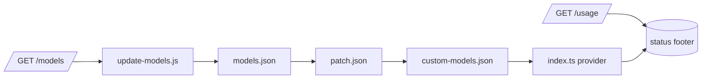

<div align="center">

<p align="center"></p>

# pi-yolo-auto

**A pi provider extension for the Yolo-Auto flat-rate Qwen3.8-27B API**

_Adds an OpenAI-compatible provider with auto model-catalog sync and per-session subscription (Free/Builder/Pro) usage to pi._

[](https://github.com/ryan-brosas/pi-yolo-auto/actions/workflows/ci.yml) [](https://github.com/ryan-brosas/pi-yolo-auto/actions/workflows/live-provider-probe.yml) [](package.json) [](LICENSE)

</div>

## Run

```sh
pi --model yolo-auto/qwen3.8-27b "hello"
```

Loads the provider from the pi package registry and runs one turn against the
Yolo-Auto endpoint. The extension serves the embedded model catalog immediately
and refreshes it from `GET /models` on session start, so the first real prompt
already has a resolved model id.

## Why pi-yolo-auto?

| | Capability | What it unlocks |
| :-: | --- | --- |
| ⚡ | **Flat-rate LLM access** | A paid Qwen3.8-27B endpoint integrated like any native pi provider, with no per-token surprise. |
| 🔄 | **Self-updating model catalog** | Stale-while-revalidate sync keeps `models.json` current without downtime or manual edits. |
| 📊 | **Subscription visibility** | The status footer shows your tier (Free/Builder/Pro) and request counters straight from `/usage`. |

## How it fits



The extension entry point (`index.ts`) is the composition root: it registers the
provider, owns the stale-while-revalidate loop over the embedded catalog, and
feeds the subscription footer. The pure pipeline (`models.ts`, `usage.ts`) stays
dependency-free so it is unit-testable without pi-ai.

## Install

Install the published package with pi or npm:

```bash
pi install npm:pi-yolo-auto
# or, from the npm registry directly:
npm install -g pi-yolo-auto
```

Then load the extension and I'll see a `yolo-auto` provider in `/model`:

```bash
pi update --extensions   # or restart pi
```

## Auth

Get your API key from your Yolo-Auto account, then log in from inside pi (recommended):

```bash
/login yolo-auto
```

You'll be prompted to paste the key; it is stored in `~/.pi/agent/auth.json`
(key in the `access` slot) and never printed back.

An environment variable is optional for headless/CI use (the `model-sync` and
`live-provider-probe` workflows use it):

```bash
export YOLO_AUTO_API_KEY=sk-...
```

The `/login` path is canonical; the env var is a convenience fallback for
shells where you cannot be prompted.

## Usage

```sh
pi --list-models yolo-auto
pi --model yolo-auto/qwen3.8-27b "hello"
```

Credentials come from two coequal sources: `~/.pi/agent/auth.json`
(`{ "yolo-auto": { "type": "api_key", "key": "sk-..." } }`) or the
`YOLO_AUTO_API_KEY` environment variable. The key is resolved at request time and
never stored or printed. Development commands live in `package.json`:

```sh
npm test                     # offline unit tests
npm run check                # syntax check all files
npm run typecheck            # strict pure-pipeline typecheck
npm run verify               # check + typecheck + test
npm run update-models        # sync models.json from the API (needs a key)
```

## Documentation

- Configuration & data ownership: [AGENTS.md](AGENTS.md)
- Model catalog pipeline: [models.ts](models.ts)
- Subscription parser: [usage.ts](usage.ts)
- Model cache & sync: [scripts/update-models.js](scripts/update-models.js)

> [!WARNING]
>
> The exact `/v1/usage` response shape is not yet confirmed against a live key; the
> parser (`usage.ts`) is deliberately tolerant and will be pinned once the live
> probe confirms the real field names.

## License

MIT, © 2026 Ryan Brosas. Third-party licenses are listed in THIRD_PARTY_NOTICES.md
when they exist.
