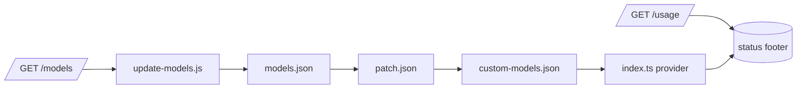

<div align="center">

<p align="center"></p>

# pi-yolo-auto

**A pi provider extension for the Yolo-Auto flat-rate Qwen3.8-27B API**

_Adds an OpenAI-compatible provider with auto model-catalog sync and per-session subscription (Free/Builder/Pro) usage to pi._

[](https://github.com/ryan-brosas/pi-yolo-auto/actions/workflows/ci.yml) [](https://github.com/ryan-brosas/pi-yolo-auto/actions/workflows/live-provider-probe.yml) [](package.json) [](LICENSE)

</div>

## Run

```sh
pi --model yolo-auto/qwen3.8-27b "hello"
```

Loads the provider from the pi package registry and runs one turn against the
Yolo-Auto endpoint. The extension serves the embedded model catalog immediately
and refreshes it from `GET /models` on session start, so the first real prompt
already has a resolved model id.

## Why pi-yolo-auto?

|    | Capability                      | What it unlocks                                                                                                                                  |
|:--:|---------------------------------|--------------------------------------------------------------------------------------------------------------------------------------------------|
| ⚡ | **Flat-rate LLM access**        | A paid Qwen3.8-27B endpoint integrated like any native pi provider, with no per-token surprise.                                                  |
| 🔄 | **Self-updating model catalog** | Stale-while-revalidate sync keeps `models.json` current without downtime or manual edits.                                                        |
| 📊 | **Subscription visibility**     | The status footer shows your tier (Free/Builder/Pro) and request counters straight from `/usage`.                                                |
| 🪟 | **Plan-aware context**          | Qwen3.8-27B reports 128K context on Free/Builder and 256K on Pro, matching the site tiers; the catalog hot-swaps when the detected plan changes. |

## How it fits



The extension entry point (`index.ts`) is the composition root: it registers the
provider, owns the stale-while-revalidate loop over the embedded catalog, and
feeds the subscription footer. The pure pipeline (`models.ts`, `usage.ts`) stays
dependency-free so it is unit-testable without pi-ai.

## Available Models

| Model       | Context | Vision | Reasoning | Input $/M | Cache Read $/M | Output $/M |
|-------------|---------|--------|-----------|-----------|----------------|------------|
| Qwen3.8 27B | 131K    | ✅     | ✅        | $0.00     | $0.00          | $0.00      |

## Install

Install the published package as a project dependency:

```bash
npm i pi-yolo-auto
```

or register it with pi:

```bash
pi install npm:pi-yolo-auto
```

Then load the extension and a `yolo-auto` provider appears in `/model`:

```bash
pi update --extensions   # or restart pi
```
## Auth

Get your API key from your Yolo-Auto account, then log in from inside pi (recommended):

```bash
/login yolo-auto
```

You'll be prompted to paste the key; it is stored in `~/.pi/agent/auth.json`
(key in the `access` slot) and never printed back.

The `/login` path is the one and only auth path. No environment variable.

## Usage

```sh
pi --list-models yolo-auto
pi --model yolo-auto/qwen3.8-27b "hello"
```

Credentials are read from `~/.pi/agent/auth.json` (written by `/login`) and
resolved at request time; they are never stored by this package or printed.
Development commands live in `package.json`:

```sh
npm test                     # offline unit tests
npm run check                # syntax check all files
npm run typecheck            # strict pure-pipeline typecheck
npm run verify               # check + typecheck + test
npm run update-models        # sync models.json from the API (needs a key)
```

## Releasing

Releases ship through a version bump + tag. Pushing the tag runs two workflows:
`npm-publish` (publishes to npm) and `release` (verifies + creates a detailed
GitHub Release with categorized commits and diffstat):

```sh
npm version patch -m "chore(release): %s"   # bumps package.json, commits, tags vX.Y.Z
git push origin main --follow-tags          # triggers both workflows
```

npm auth — pick one (auto-detected by the workflow):

- **Option A — `NPM_TOKEN` secret:** create an npm access token with publish
  scope (npmjs.com → Access Tokens) and add it as a repository secret named
  `NPM_TOKEN`.
- **Option B — npm trusted publisher (recommended, no secret stored):**
  register this repo on npm (package → Access → Trusted publishers, or run
  `npm publish --provenance` once from a logged-in machine). The workflow then
  publishes via OIDC with `--provenance`.
## Documentation

- Configuration & data ownership: [AGENTS.md](AGENTS.md)
- Model catalog pipeline: [models.ts](models.ts)
- Subscription parser: [usage.ts](usage.ts)
- Model cache & sync: [scripts/update-models.js](scripts/update-models.js)

> [!WARNING]
>
> The exact `/v1/usage` response shape is not yet confirmed against a live key; the
> parser (`usage.ts`) is deliberately tolerant and will be pinned once the live
> probe confirms the real field names.

## License

MIT, © 2026 Ryan Brosas. Third-party licenses are listed in THIRD_PARTY_NOTICES.md
when they exist.
